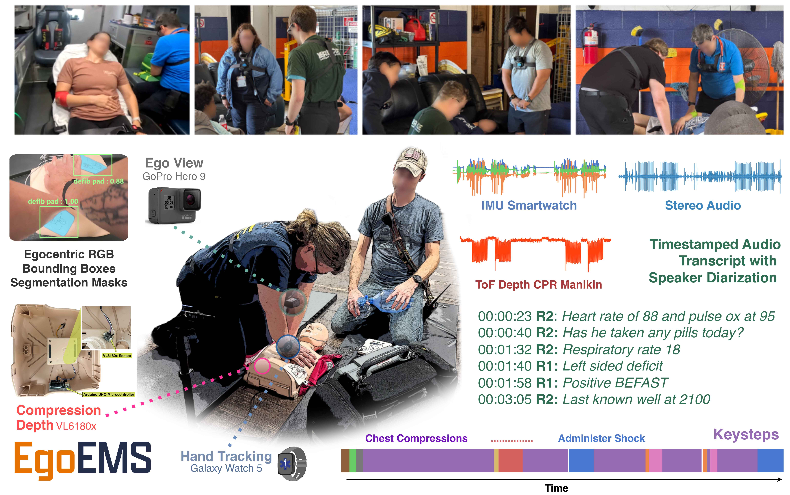
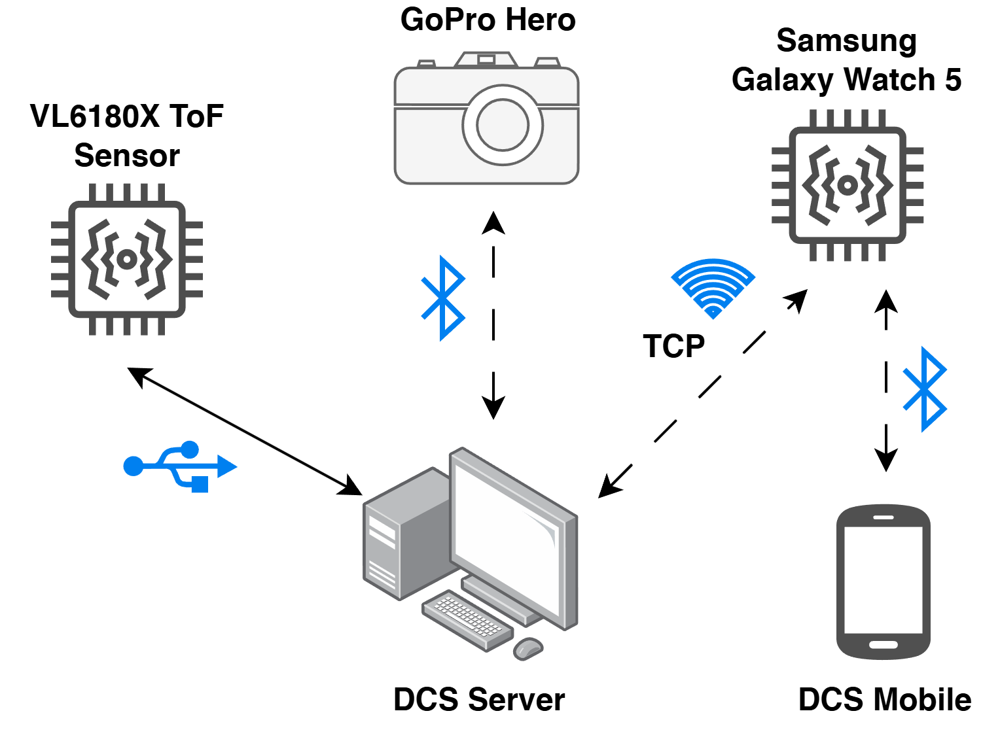

<h1 align="center">🩺 EgoEMS: A High-Fidelity Multimodal Egocentric Dataset for Cognitive Assistance in Emergency Medical Services</h1>

<div align="center">

[]()
[](https://uva-dsa.github.io/EgoEMS/)
[]()
[]()

</div>


> **EgoEMS** is the first end-to-end, high-fidelity multimodal multiperson dataset capturing egocentric video, audio, IMU data of Emergency Medical Service (EMS) procedures. Developed in collaboration with EMS professionals, it supports research in activity recognition, multimodal fusion, and cognitive assistance for real-time decision support.

---

## 🔥 News

- **[2025/11]** Paper got accepted to AAAI 2026 - AISI Track 🔥.
- **[2025/08]** Paper submitted to AAAI 2026 - AISI Track.

---

## 📦 Overview



EgoEMS provides >20 hours of synchronized multimodal data across 233 emergency scenarios, performed by over 45 trained EMS professionals and medical students. Each trial is annotated with keysteps, timestamped transcripts, and CPR metrics.

---

## 🎯 [Benchmarks](Benchmarks/README.md)


We provide three primary benchmarks (with code and instructions in their respective folders):

1. [**Keystep Classification**](Benchmarks/ActionRecognition/README.md)

   → Classify procedural steps from multimodal input sequences.

2. [**Keystep Segmentation**](Benchmarks/ActionRecognition/README.md)   

   → Detect transitions between procedural keysteps over time.

3. [**CPR Quality Estimation**](Benchmarks/CPR_quality//README.md)   

   → Estimate compression rate and depth using smartwatch IMU and egocentric video.

Please visit each subfolder for detailed instructions, annotations, and code for each benchmark.

---

## 📂 Data Access 

### Option 1: Harvard Dataverse  
[🔗 Full Dataset]()

### Option 2: Alternate Hosting  
[🔗 Full Dataset (TBD)]()

---


## 📷 [Data Collection System](DCS/README.md) 

<p align="center">
  
</p>

See the [DCS folder](DCS/README.md) for instructions on setting up the data collection system.

---


## 🖋 Citation

If you use this dataset in your work, please consider citing our paper:

```bibtex

```

---

## ❤️ Acknowledgements


📬 Contact: [Keshara Weerasinghe](cjh9fw@virginia.edu) — PhD Candidate, Computer Engineering, University of Virginia

---

> 📌 *This README is a work in progress. Please check back soon for updated links, code, and documentation.*
