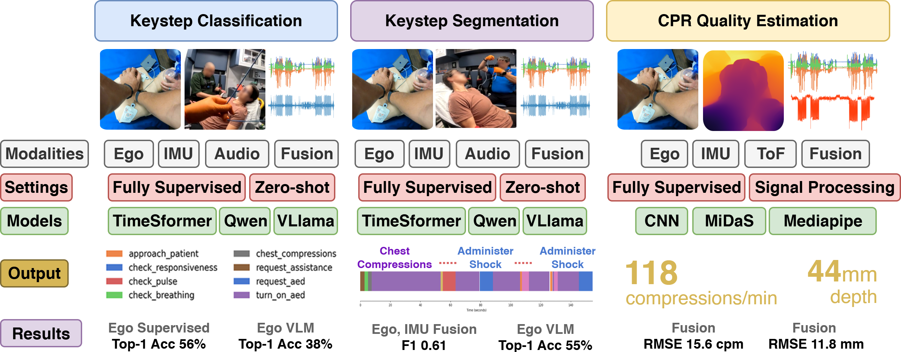

# 🩺 EgoEMS: A High-Fidelity Multimodal Egocentric Dataset for Cognitive Assistance in Emergency Medical Services

[]()
[]()
[]()

> **EgoEMS** is the first end-to-end, high-fidelity multimodal multiperson dataset capturing egocentric video, audio, IMU data of Emergency Medical Service (EMS) procedures. Developed in collaboration with EMS professionals, it supports research in activity recognition, multimodal fusion, and cognitive assistance for real-time decision support.

---

## 🔥 News

- **[2025/07]** Paper submitted to X.

---

## 📦 Overview


EgoEMS provides >20 hours of synchronized multimodal data across 233 emergency scenarios, performed by over 45 trained EMS professionals and medical students. Each trial is annotated with keysteps, timestamped transcripts, and CPR metrics.

---

## 🎯 Benchmarks



We provide three primary benchmarks (with code and instructions in their respective folders):

1. **Keystep Classification**  
   → Classify procedural steps from multimodal input sequences.

2. **Keystep Segmentation**  
   → Detect transitions between procedural keysteps over time.

3. **CPR Quality Estimation**  
   → Estimate compression rate and depth using smartwatch IMU and egocentric video.

Please visit each subfolder for detailed instructions, annotations, and code for each benchmark.

---

## 📂 Data Access

### Option 1: Harvard Dataverse  
[🔗 Full Dataset (TBD)]()

### Option 2: Alternate Hosting  
[🔗 Full Dataset (TBD)]()

---

## 🖋 Citation

If you use this dataset in your work, please consider citing our paper:

```bibtex

```

---

## ❤️ Acknowledgements

REDACTED

📬 Contact: [REDACTED]() — PhD Candidate, Computer Engineering

---

> 📌 *This README is a work in progress. Please check back soon for updated links, code, and documentation.*