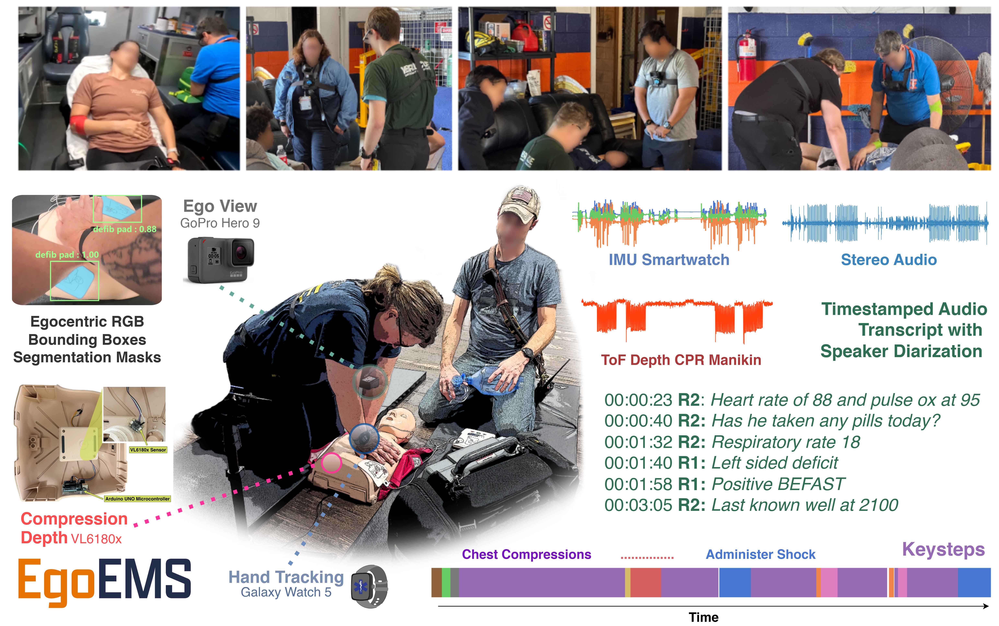
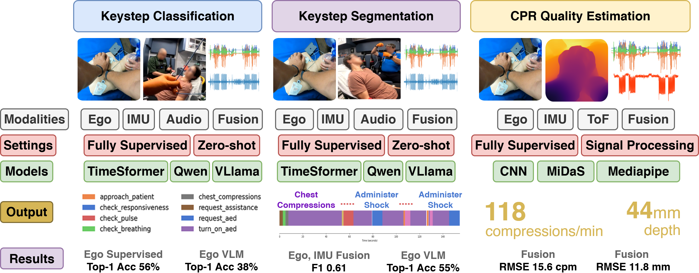
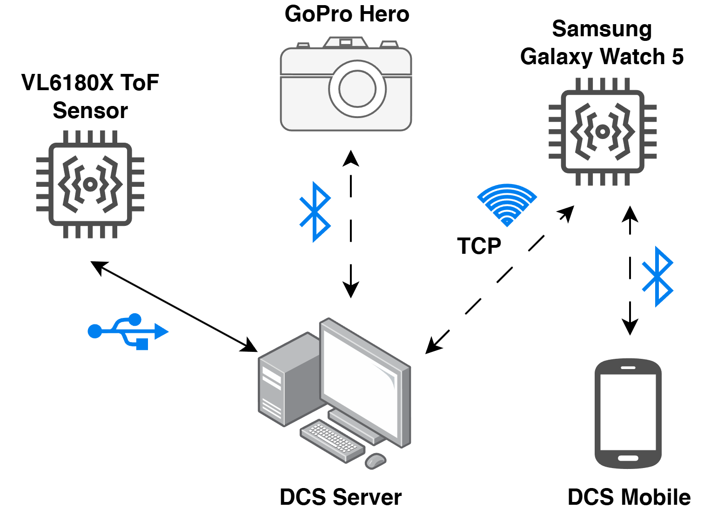

<h1 align="center">🩺 EgoEMS: A High-Fidelity Multimodal Egocentric Dataset for Cognitive Assistance in Emergency Medical Services</h1>

<div align="center">

[](https://arxiv.org/abs/2511.09894)
[](https://uva-dsa.github.io/EgoEMS/)
[](https://dataverse.harvard.edu/dataset.xhtml?persistentId=doi:10.7910/DVN/XT51K7)
[]()

</div>


> **EgoEMS** is the first end-to-end, high-fidelity multimodal multiperson dataset capturing egocentric video, audio, IMU data of Emergency Medical Service (EMS) procedures. Developed in collaboration with EMS professionals, it supports research in activity recognition, multimodal fusion, and cognitive assistance for real-time decision support.

---

## 🔥 News

- **[2025/11]** Paper got accepted to AAAI 2026 - AISI Track 🔥.
- **[2025/08]** Paper submitted to AAAI 2026 - AISI Track.

---

## 📦 Overview



EgoEMS provides >20 hours of synchronized multimodal data across 233 emergency scenarios, performed by over 45 trained EMS professionals and medical students. Each trial is annotated with keysteps, timestamped transcripts, and CPR metrics.

---

## 🎯 [Benchmarks](Benchmarks/README.md)



We provide three primary benchmarks (with code and instructions in their respective folders):

1. [**Keystep Classification**](Benchmarks/ActionRecognition/README.md)

   → Classify procedural steps from multimodal input sequences.

2. [**Keystep Segmentation**](Benchmarks/ActionRecognition/README.md)   

   → Detect transitions between procedural keysteps over time.

3. [**CPR Quality Estimation**](Benchmarks/CPR_quality//README.md)   

   → Estimate compression rate and depth using smartwatch IMU and egocentric video.

Please visit each subfolder for detailed instructions, annotations, and code for each benchmark.

---

## 📂 Data Access 

### Option 1: Harvard Dataverse  
[🔗 Full Dataset](https://dataverse.harvard.edu/dataset.xhtml?persistentId=doi:10.7910/DVN/XT51K7)

The EgoEMS Dataverse repository is public. For users with high bandwidth, the full dataset is provided in two archive files (`part1.zip` and `part2.zip`). Download both parts and extract them into a single root directory. Alternatively, you can download per-subject archives (62 in total) and extract them into the same root.  
After extraction, ensure that all subject folders sit under one common dataset root (e.g., `/path/to/EgoEMS/`).

#### Annotation files (`Annotations/`)

All annotation files live in the repository under the `Annotations/` folder:

- `Annotations/aaai26_main_annotation_classification.json`
- `Annotations/aaai26_main_annotation_segmentation.json`
- `Annotations/aaai26_main_annotation_cpr_quality.json`
- `Annotations/structure.json` – schematic example of the dataset layout and metadata
- `Annotations/splits/` – predefined train/val/test splits for all three tasks

The three main JSONs share the same hierarchical structure and differ only in which keysteps/trials are included for each benchmark task (classification, segmentation, CPR quality estimation).

At a high level, each annotation file has the following structure:

```json
{
  "subjects": [
    {
      "subject_id": "P0",
      "expertise_level": "Not certified",
      "scenarios": [
        {
          "scenario_id": "cardiac_arrest",
          "trials": [
            {
              "trial_id": "s2",
              "streams": {
                "smartwatch_data": {
                  "file_id": "...",
                  "file_path": "P0/cardiac_arrest/s2/smartwatch_data/...csv"
                },
                "i3d_flow": {
                  "file_id": "...",
                  "file_path": "P0/cardiac_arrest/s2/i3d_flow/...npy"
                },
                "i3d_rgb": { "file_id": "...", "file_path": "..." },
                "resnet_ego": { "file_id": "...", "file_path": "..." },
                "clip_ego": { "file_id": "...", "file_path": "..." },
                "distance_sensor_data": { "file_id": "...", "file_path": "..." },
                "ego": { "file_id": "...", "file_path": "P0/cardiac_arrest/s2/ego/...mp4" }
              },
              "keysteps": [
                {
                  "keystep_id": "1_metadata",
                  "start_t": 0.0,
                  "end_t": 106.97,
                  "label": "chest_compressions",
                  "class_id": 4
                }
              ]
            }
          ]
        }
      ]
    }
  ]
}
```

- `subjects` – list of participants with `subject_id` and `expertise_level`.
- `scenarios` – different emergency scenarios (e.g., `cardiac_arrest`).
- `trials` – individual runs for a given subject and scenario.
- `streams` – available modalities for that trial (ego video, feature numpy arrays, smartwatch CSV, distance sensor CSV, etc.), each with:
  - `file_id` – an internal identifier.
  - `file_path` – path relative to your dataset root (the root you extracted Dataverse archives into).
- `keysteps` – annotated procedural steps for that trial, with:
  - `keystep_id` – unique ID string.
  - `start_t`, `end_t` – temporal boundaries in seconds.
  - `label` – human-readable keystep label.
  - `class_id` – integer category used by benchmark code.

`Annotations/structure.json` provides a compact, illustrative schema of this hierarchy and can be used as a reference when writing custom tooling.

### Python access via the EgoEMS dataset class

We provide a small Python package wrapping the annotations and file paths into PyTorch `Dataset` objects under `Dataset/pytorch_implementation/EgoEMS/`.

#### Installation

From the root of this repository:

```bash
cd Dataset/pytorch_implementation/EgoEMS
pip install -e .
```

This installs a package named `EgoEMS` that exposes dataset classes and utilities.

#### Basic usage

```python
from EgoEMS.EgoEMS import EgoEMSDataset, collate_fn, transform
from torch.utils.data import DataLoader

annotation_file = "Annotations/aaai26_main_annotation_classification.json"
data_root = "/path/to/unzipped/EgoEMS"  # root folder containing subject directories

dataset = EgoEMSDataset(
    annotation_file=annotation_file,
    data_base_path=data_root,
    fps=29.97,
    frames_per_clip=150,            # observation window in frames (optional)
    transform=transform,            # default resize to 224x224 for video frames
    data_types=["video", "audio"],  # any subset of: "video", "video_exo",
                                    # "flow", "rgb", "resnet_ego", "resnet_exo",
                                    # "clip_ego", "clip_exo", "smartwatch", "depth_sensor"
    task="classification",          # or "segmentation" or "cpr_quality"
)

loader = DataLoader(dataset, batch_size=8, shuffle=True, collate_fn=collate_fn)

for batch in loader:
    frames = batch["frames"]          # [B, T, C, H, W] if video requested
    audio = batch["audio"]            # [B, T, ...] if audio requested
    labels = batch["keystep_label"]   # list of string labels
    class_ids = batch["keystep_id"]   # tensor of class indices
    # your training / evaluation code here
```

Internally, the dataset class reads the annotation JSONs in `Annotations/`, resolves the relative `file_path` entries using `data_base_path`, loads the requested modalities, and yields keystep-level clips suitable for the benchmark tasks.


### Option 2: Alternate Hosting  
[🔗 Full Dataset (TBD)]()

---


## 📷 [Data Collection System](DCS/README.md) 

<p align="center">
  
</p>

See the [DCS folder](DCS/README.md) for instructions on setting up the data collection system.

---


## 🖋 Citation

If you use this dataset in your work, please consider citing our paper:

```bibtex
@misc{weerasinghe2025egoemshighfidelitymultimodalegocentric,
      title={EgoEMS: A High-Fidelity Multimodal Egocentric Dataset for Cognitive Assistance in Emergency Medical Services}, 
      author={Keshara Weerasinghe and Xueren Ge and Tessa Heick and Lahiru Nuwan Wijayasingha and Anthony Cortez and Abhishek Satpathy and John Stankovic and Homa Alemzadeh},
      year={2025},
      eprint={2511.09894},
      archivePrefix={arXiv},
      primaryClass={cs.AI},
      url={https://arxiv.org/abs/2511.09894}, 
}
```

---

## ❤️ Acknowledgements


📬 Contact: [Keshara Weerasinghe](cjh9fw@virginia.edu) — PhD Candidate, Computer Engineering, University of Virginia

---

> 📌 *This README is a work in progress. Please check back soon for updated links, code, and documentation.*
